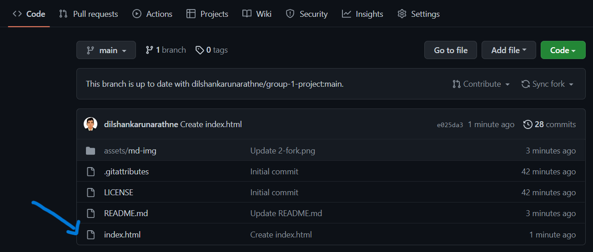
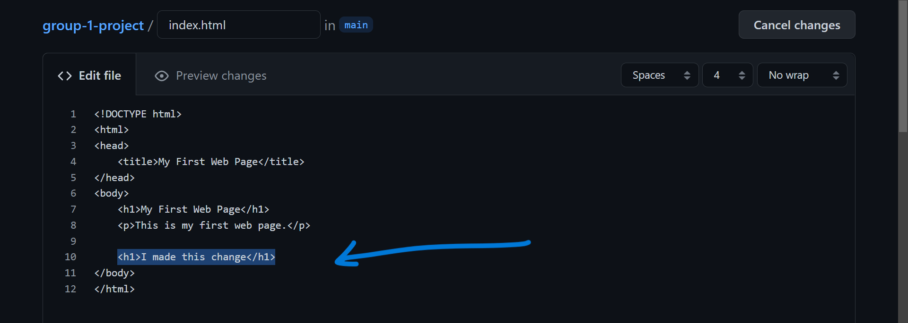

# Career Guidance Programme - Group 1 Project

Career guidance program of Faculty of Applied Science (2022-11-5).

# Instructions for contributors...

## Step 1 - Sign in
Log-in to your GitHub account.  
[Click Here to Sign-in](https://github.com/login)  
(Skip this step if you're already logged-in)

## Step 2 - Fork the repository
Fork this repository.  

1. Click on the Fork button on the top right corner of this page.  

2. You will be redirected to your forked repository.  
  
Click on **Create fork** button.

3. You will be redirected to your forked repository.   

## Step 3 - Edit the file

1. Click on any file to edit it.  

  
(I am editing the index.html file here for demonstration purposes)

2. Click on **Edit this file** button.  

3. Make the changes you want to make.  

## Step 4 - Commit the changes

1. Fill up the required information about the changes you just made.  
This is important, so make sure to give a proper description.  
And then click on **Commit changes** button.
 

2. You will be redirected back to the file you just edited.  
But now you will be able to see the changes you just made.

3. Make all the changes you want to make for a specific improvement of the code before you move on to the next step.

## Step 5 - Create a pull request

1. Click on **Pull requests** tab.  

2. Click on **New pull request** button.  

3. You will be redirected to the pull request page.  
You will be able to see the changes you just made here.

4. Click on **Create pull request** button.

5. Add a title and description to your pull request.  
The discription must provide a proper explanation of the changes you made. And the title should be short and precise. 

6. Click on **Create pull request** button.  

## Step 6 - Wait for the pull request to be merged

1. Now you have successfully created a pull request.  

The maintainers of the repository will review your pull request and merge it if it is found to be correct.  
Be patient and wait for further instructions by the maintainers.  
They may ask you to make some changes to your pull request. If so, you will have to make the changes and create a new pull request.

2. You will be able to see the status of your pull request here.  
The maintainers may approve, comment or request changes to your pull request. 

3. After all the changes are made, your pull request will be merged.  
You will see that the status of your pull request has changed to **Merged**, and the **Merge pull request** button will be replaced by **Closed** button. 

## Congratulations! You have successfully contributed to the project. 

This is how you should contribute to the project. 

